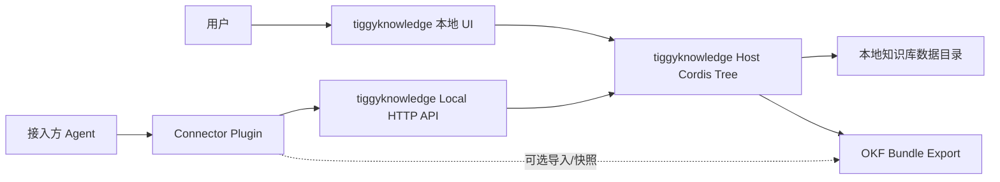
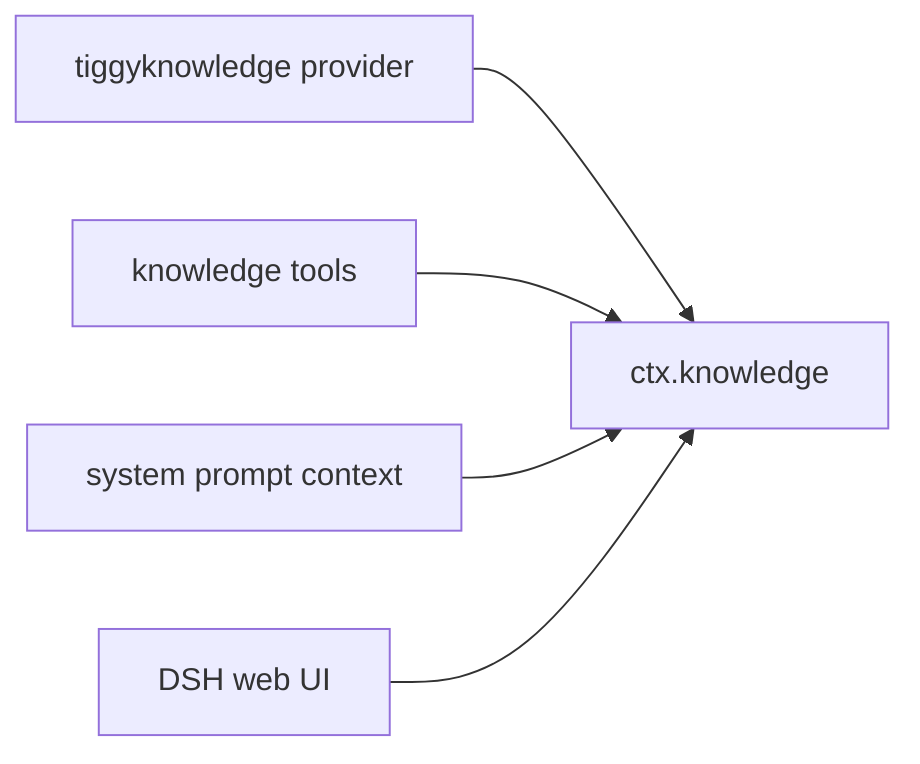

# tiggyknowledge 智能体集成打通方案（DSH 参考实现）

> 说明：这份文档描述的是 DSH 的参考接入路径。更通用的对外标准接口请看 `agent-integration-api.md`，对外设置页统一称为“智能体集成”。

## 目标

tiggyknowledge 先保持一个独立可用的本地知识库产品，同时作为 deepseek harness 的可选知识能力插件。打通后的核心体验是：用户在 tiggyknowledge 中维护知识库，deepseek harness 的 agent 在需要时通过工具检索、读取和引用这些知识，而不是把知识库逻辑塞进 agent loop。

第一阶段不做重同步、不做企业端账号体系、不把 tiggyknowledge 直接嵌进 deepseek harness 进程。先用最小、稳定、可回退的 sidecar 方式验证能力边界。

## 设计原则

- everything is plugin：tiggyknowledge 自身保持 Host 插件、Client 插件、可选插件拆分；接入方侧也只通过一个 Connector 插件接入。
- 本地优先：默认连接 `http://127.0.0.1:3210` 的 tiggyknowledge 本地服务。
- 只读先行：第一版只允许 agent 查询、读取、引用知识，不允许默认写入知识库。
- 显式配置：deepseek harness 通过 profile / cordis patch 启用，不默认打开。
- 协议优先于 UI：agent 接入走 HTTP API / OKF 数据，不依赖浏览器页面。
- 可独立运行：tiggyknowledge 不因为接入方未安装而降级；Connector 不因为 tiggyknowledge 未启动而阻塞主 agent。

## 推荐架构



## 两侧职责

### tiggyknowledge 侧

tiggyknowledge 继续拥有知识库的真实数据与产品能力：

- 知识库、文档、标签、收藏、预览、搜索、OKF 导出；
- 本地数据目录和原文件管理；
- 可选图谱插件、可选语义/向量插件；
- 本地 HTTP API，供自身 Web UI 和 Connector 共用。

近期需要补齐的 Connector 友好能力：

- `/api/search` 已有，可作为第一版检索入口；
- `/api/documents/:id/preview` 已有，可作为读取入口；
- `/api/documents/:id/okf` 已有，可作为结构化引用入口；
- 新增 `/api/capabilities` 或扩展 `/api/system`，声明当前启用能力；
- 新增只读访问令牌配置，避免任意本机进程直接调用敏感 API。

### 接入方侧（参考：deepseek harness）

DSH 不直接管理 tiggyknowledge 的数据库。它只安装一个可选 Connector 插件，向 agent 提供模型可见工具：

- `knowledge_search`：检索本地知识库；
- `knowledge_read`：读取某个文档的摘要/正文片段；
- `knowledge_okf`：读取某个文档的 OKF 映射；
- `knowledge_status`：检查 tiggyknowledge 是否启动、连接到哪个数据目录、启用了哪些能力。
- `knowledge_capabilities`：在不提供 Token 时发现协议版本、只读操作和搜索模式。

第一版不要提供写入工具。等权限、审计、确认框成熟后，再考虑：

- `knowledge_create_note`
- `knowledge_tag_document`
- `knowledge_import_file`

## 第一阶段 MVP

### 1. tiggyknowledge 暴露稳定只读 API

UI 仍复用现有 API；Connector 使用专门的 Bearer Key 只读 API：

| 能力 | API | DSH 工具 |
|---|---|---|
| 状态检查 | `GET /api/tiggyknowledge/status` | `knowledge_status` |
| 知识库列表 | `GET /api/tiggyknowledge/libraries` | `knowledge_list_libraries` |
| 搜索 | `POST /api/tiggyknowledge/search` | `knowledge_search` |
| 文档读取 | `GET /api/tiggyknowledge/documents/:id/read` | `knowledge_read` |
| OKF 映射 | `GET /api/tiggyknowledge/documents/:id/okf` | `knowledge_okf` |
| OKF Bundle | `GET /api/libraries/:id/okf-bundle` | 后续导入/快照 |

第一版 Connector 只读这些 API，并使用 `Authorization: Bearer <访问 Key>`。

### 2. 参考 Connector 插件与 Composer 上下文插件

建议包名放在 tiggyknowledge 侧，作为外部 DSH 插件交付：

```text
packages/dsh/connector
  package.json
  src/index.ts
  README.md

packages/dsh/context
  package.json
  lib/client.js
  README.md
```

包名：

```text
@tiggyknowledge/dsh-connector
@tiggyknowledge/dsh-context
```

它们在接入方里通过 Cordis patch 启用。发布或安装到 profile 后使用包名：

```yaml
- insert:
    - id: tiggyknowledge-context
      name: '@tiggyknowledge/dsh-context'

    - id: tiggyknowledge-connector
      name: '@tiggyknowledge/dsh-connector'
      config:
        endpoint: 'http://127.0.0.1:3210'
        tools:
          search: true
          read: true
          okf: true
          write: false
```

本地开发可以直接使用源码 overlay：

```sh
pnpm dsh --profile headless \
  --patch "../tiggyknowledge/packages/dsh/connector/deepseek-harness.local.patch.yml" \
  "先调用 knowledge_status 看看本地知识库"
```

也可以先把 connector 安装到某个 DSH profile：

```sh
pnpm dsh plugin --profile headless add "link:/Users/viito/Documents/deepseek harness/tiggyknowledge/packages/dsh/connector"
```

然后在该 profile 的 `cordis.patch.yml` 中使用 `@tiggyknowledge/dsh-connector`。

可分发部署见 `docs/dsh-plugin-deployment.md`。TiggyKnowledge 侧提供 tgz 产物；目标 DSH 实例只需要安装插件和配置 token，不需要复制源码。

### 3. 工具行为

`knowledge_search` 输入：

```ts
interface KnowledgeSearchToolInput {
  query: string
  knowledgeBaseIds?: string[]
  topK?: number
  favoriteOnly?: boolean
}
```

返回要短，适合模型继续决策：

```ts
interface KnowledgeSearchToolResult {
  results: Array<{
    documentId: string
    title: string
    libraryId: string
    sourceType: 'text' | 'markdown' | 'pdf'
    snippet: string
    score: number
    tags: string[]
  }>
}
```

`knowledge_read` 输入：

```ts
interface KnowledgeReadToolInput {
  documentId: string
  maxCharacters?: number
}
```

返回：

```ts
interface KnowledgeReadToolResult {
  documentId: string
  title: string
  sourceType: string
  content: string
  truncated: boolean
}
```

`knowledge_okf` 输入：

```ts
interface KnowledgeOkfToolInput {
  documentId: string
}
```

返回 OKF mapping 的精简结构，避免一次塞太大。

## 为什么不第一版做 in-process 接入

deepseek harness 和 tiggyknowledge 都基于 Cordis，但第一版不建议把 tiggyknowledge Host 插件直接装进 DSH 的同一个 Cordis tree。

原因：

- 两边的 service map、启动组合、构建 face、浏览器/Host 分层不同；
- DSH 有工具流水线、会话日志、权限、沙箱、agent 生命周期等严格约束；
- tiggyknowledge 当前 Host API 更像本地产品 BFF，不是 DSH capability seam；
- in-process 会让两个产品的发布节奏、数据目录、依赖版本绑得太紧。

sidecar 的好处：

- tiggyknowledge 独立可启动、可升级、可调试；
- Connector 是小插件，失败时只影响知识工具；
- API 协议稳定后，未来仍可做 in-process provider。

## 第二阶段：协议升级

当第一版工具稳定后，再抽象一个更正式的 Knowledge Provider seam。

接入方侧可以考虑：

```text
ctx.knowledge
```

角色拆分：

- Service Definition：定义搜索、读取、引用、能力声明；
- Provider：tiggyknowledge provider、OKF bundle provider、企业服务端 provider；
- Consumer：面向模型工具、系统提示词上下文、UI 引用面板。

这时 `@tiggyknowledge/dsh-connector` 可以从“工具插件”演进成“provider 插件”：



## 第三阶段：云端形态与手动迁移

企业端和本地端都应该遵守同一套 TiggyKnowledge 标准接口，但下一阶段不做实时同步。DSH 也不应该理解迁移或同步细节，只连接用户当前配置的 provider：

- provider 可以是本地端，也可以是企业端；
- 本地端默认连接 `http://127.0.0.1:3210`；
- 企业端连接企业部署地址，例如 `https://knowledge.example.com`；
- 数据跨端流转最多通过 `.tiggykb` 导出/导入完成；
- 不做实时同步、后台自动同步、双向增量同步或冲突合并；
- 文档 id 需要变成稳定全局 id 或带 namespace 的 id。

建议 id 格式：

```text
tk://local/<libraryId>/<documentId>
tk://enterprise/<tenantId>/<libraryId>/<documentId>
```

## 安全与权限

第一版必须默认只读：

- Connector 没有 token 时只能读公开状态，不能读取文档内容；
- 写操作默认不存在；
- 如果未来加写工具，必须走用户确认；
- 工具返回必须控制长度，避免把整本 PDF 一次塞给模型；
- 返回结果带来源字段，方便 agent 引用来源。

本地 API 建议：

- 默认只监听 `127.0.0.1`；
- 支持 `TIGGYKNOWLEDGE_TOKEN` 作为 dsh credentials 引用名；
- 对 POST/写入继续保留 same-origin 检查；
- Connector 使用 `Authorization: Bearer <token>`。

## 与 OKF 的关系

OKF 是 tiggyknowledge 和 DSH 之间的长期数据协议候选。

第一版：

- DSH 工具直接读 search/preview/okf API；
- OKF 用于解释文档来源、概念映射、引用出处。

第二版：

- DSH 可以直接导入一个 OKF Bundle 快照；
- 离线场景下，不需要 tiggyknowledge 常驻；
- 但快照不可替代实时搜索，本地产品仍是主数据源。

## 插件默认状态建议

在 tiggyknowledge 侧：

- 图谱插件默认关闭；
- Connector API 能力默认关闭；
- 基础知识库、搜索、预览、OKF 默认开启。

在接入方侧：

- `@tiggyknowledge/dsh-connector` 默认不装入任何 profile；
- 用户通过 profile patch 显式启用；
- connector 注册 `tiggyknowledge` settings namespace，DSH 设置/配置客户端只需要看到 `endpoint` 和只读工具开关；
- 访问 Key 明文不进入普通 settings，DSH 固定保存到 `TIGGYKNOWLEDGE_TOKEN` 凭据引用名下，真实值走 credentials；
- 启用失败时，agent 只少一个知识工具，不影响主流程。

## 实施顺序

### 已落地：tiggyknowledge 设置侧

- 新增“设置 → 智能体集成”Client 插件：`@tiggyknowledge/client-settings-dsh-integration`；
- 支持保存本机 endpoint 和启用状态；
- DSH 侧访问 Key 固定使用 `TIGGYKNOWLEDGE_TOKEN` 凭据引用名；
- 知识库范围不再进入 connector 默认配置，由每次发送消息时的知识库选择器指定；选择“全部知识库”时省略 `knowledgeBaseIds`；
- 支持生成访问 Key：明文只在生成后显示一次，落盘保存哈希和尾号预览；
- 生成访问 Key 后支持复制 Key 和 `export <凭据名>=<访问 Key>` 兼容命令；
- 后端新增 `PUT /api/settings/agent-integration`，配置持久化到本地 `settings.yaml`。
- 后端新增 `POST /api/settings/agent-integration/access-key`，用于轮换访问 Key。
- 后端新增智能体标准只读 API：`/api/tiggyknowledge/status`、`/api/tiggyknowledge/libraries`、`/api/tiggyknowledge/search`、`/api/tiggyknowledge/documents/:id/read`、`/api/tiggyknowledge/documents/:id/okf`。
- 不再保留 `/api/dsh/*` 或 `/api/agent/*` 兼容路径；DSH connector 作为参考实现也调用标准路径。
- 新增外部 connector 源码包：`packages/dsh/connector`，导出 `@tiggyknowledge/dsh-connector`，注册 `knowledge_status`、`knowledge_list_libraries`、`knowledge_search`、`knowledge_read`、`knowledge_okf`。

### P0：方案确认

- 确认 sidecar 优先；
- 确认第一版只读；
- 确认 DSH 通过 Cordis patch 显式启用；
- 确认工具名称和返回结构。

### P1：tiggyknowledge API 补强

- 增加 `/api/capabilities` 或扩展 `/api/system`；
- 增加本地只读 token 配置；
- 给 search/read/okf 返回加入稳定引用信息；
- 文档读取增加 `maxCharacters` 或分页参数。

### P2：参考 Connector 插件

- 新建 `@tiggyknowledge/dsh-connector`；
- 提供 `knowledge_status`、`knowledge_search`、`knowledge_read`、`knowledge_okf`；
- 写 README 和 Cordis patch 示例；
- 增加连接失败、未启动、token 错误的清晰错误。

### P3：体验打磨

- 接入方回答中自动带来源；
- tiggyknowledge UI 提供“复制示例 patch 配置”；
- 设置页展示“智能体集成状态”；
- 支持打开来源文档的本地链接。

### P4：后续 TODO

- 写入工具与确认框；
- OKF Bundle 离线 provider；
- 企业服务端 provider；
- 向量/语义检索 provider；
- in-process Cordis provider；
- 本地/企业同步后的统一 id。

## 当前结论

先做 sidecar connector，不做深度嵌入。tiggyknowledge 继续是独立本地产品，deepseek harness 通过一个默认关闭、显式启用的 Cordis 插件连接它。这样最符合当前 MVP：轻、稳、可验证，也不破坏两边插件化架构。
